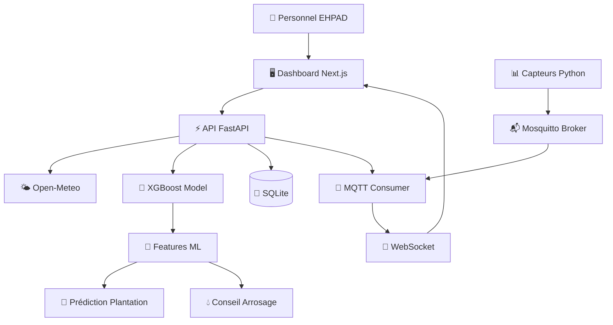

# Architecture Technique - Potager EHPAD Tomate V0

## Vue d'ensemble



## Composants principaux

### 1. Frontend - Next.js 14

**Rôle :** Interface utilisateur simple pour le personnel EHPAD

**Technologies :**
- Next.js 14 (App Router)
- Tailwind CSS (Material Design 3)
- TypeScript
- lucide-react (icônes)

**Pages :**
- `/dashboard` : Vue principale avec conseils et KPI
- `/predict` : Formulaire prédiction plantation
- `/history` : Historique des prédictions
- `/settings` : Configuration profil potager

**Communication :**
- REST API vers backend
- WebSocket pour données IoT live

---

### 2. Backend - FastAPI

**Rôle :** API Python, orchestration de la logique métier

**Technologies :**
- FastAPI (async)
- Pydantic (validation)
- paho-mqtt (consumer)
- SQLite (historique)

**Modules :**

```python
app/
├── main.py              # Routes API
├── ml_model.py          # XGBoost + features ML
├── recommendation.py    # Prédiction plantation
├── watering_advice.py   # Conseil arrosage ✨
├── weather.py           # Client Open-Meteo
├── mqtt_consumer.py     # Consumer MQTT
├── database.py          # SQLite operations
├── schemas.py           # Pydantic models
├── config.py            # Configuration
├── garden_profile.py    # Profil potager
└── demo.py              # Mode demo fallback
```

**Endpoints :**
- Prédiction : `/predict`, `/predict/iot`
- Arrosage : `/advice/watering` ✨
- Données : `/weather`, `/iot/live`, `/garden/profile`
- Monitoring : `/health`, `/model/info`
- Historique : `/history`

---

### 3. Modèle ML - XGBoost

**Rôle :** Prédiction plantation + features réutilisables

**Type :** XGBoost Classifier (gradient boosting)

**Classes :**
- `viable` : conditions favorables pour planter
- `attendre` : conditions moyennes
- `non_viable` : conditions risquées

**Variables d'entrée (11) :**
- `saison_code`, `type_sol_code`, `irrigation_code`
- `humidite_sol`, `temp_actuelle`, `temp_min_7j`, `temp_moyenne_7j`
- `pluie_7j`, `risque_gel_7j`, `water_usage`

**Features calculées (engineered) :**

| Feature | Formule | Utilité |
|---------|---------|---------|
| `confort_thermique` | `10 - abs(temp_moy - 20) * 0.5` | Adaptation aux températures |
| `stress_hydrique` | `max(0, 50 - humidite) * (1 ou 0.3)` | Tension hydrique plante |
| `risque_secheresse` | `deficit_sol + chaleur + bonus` | Risque combiné |
| `score_saison_tomate` | Score 0.1-0.9 selon saison | Période optimale |

**Réutilisation :**
Ces features sont utilisées par :
1. Le modèle XGBoost (prédiction plantation)
2. Le système de conseil d'arrosage ✨

---

### 4. Système de conseil d'arrosage ✨

**Nouveau composant V0.2.0**

**Rôle :** Fournir des recommandations d'arrosage intelligentes

**Logique :**

```python
# 1. Calcul des features ML (identique au modèle)
stress_hydrique = max(0, 50 - humidite_sol) * (1 si pas pluie sinon 0.3)
risque_secheresse = deficit + chaleur + bonus

# 2. Analyse par priorité
if stress_hydrique > 40:
    return "Arrosage urgent nécessaire"
elif risque_secheresse > 30 and not pluie:
    return "Arrosage recommandé dans 24-48h"
elif humidite > 75:
    return "Aucun arrosage nécessaire"
# ... 5 autres cas
```

**Facteurs pris en compte :**
- Humidité du sol (capteur IoT)
- Type de sol (sableux → léger fréquent, argileux → abondant espacé)
- Type d'irrigation (aucun → stress × 1.5)
- Température (évaporation si > 25°C)
- Pluie (quantité en mm, pas booléen)

**Sortie structurée :**
```json
{
  "conseil": "Arrosage recommandé dans les 24-48h",
  "priorite": "eleve",
  "explication": "Le risque de sécheresse est élevé...",
  "facteurs_cles": ["humidite_sol_basse", "aucune_pluie_prevue"],
  "score_stress_hydrique": 22.5,
  "score_risque_secheresse": 32.5,
  "recommandation_action": "Prévoir un arrosage de 12 L/m²",
  "prochaine_verification": "Vérifier quotidiennement"
}
```

---

### 5. Météo - Open-Meteo

**API gratuite sans clé**

**Données récupérées :**
- Température actuelle
- Température min/max 7 jours
- Température moyenne 7 jours
- Précipitations totales 7 jours
- Probabilité de précipitation max
- Risque de gel (calculé si temp_min < 2°C)

**Géocodage :**
- Conversion "Rennes" → latitude/longitude
- Support latitude/longitude directes

**Fallback :**
- Mode DEMO si API indisponible
- Données météo cohérentes mais fictives

---

### 6. IoT - Simulateurs + MQTT

**V0 : Architecture simulée**

```
Capteurs Python simulés
    ↓ MQTT
Mosquitto Broker (localhost:1883)
    ↓ Subscribe
FastAPI MQTT Consumer
    ↓ In-memory state
API /iot/live + WebSocket /ws/iot
```

**Topics MQTT :**
- `farm/tomato/soil` : humidité du sol
- `farm/tomato/irrigation` : type/état irrigation
- `farm/tomato/water_usage` : consommation eau

**Simulateurs :**
```python
# Simuler 3 capteurs en parallèle
soil_sensor     : publie humidité 40-60% toutes les 15s
irrigation_sensor : publie état toutes les 30s
water_usage_sensor: publie consommation toutes les 20s
```

**Consumer FastAPI :**
- Thread background qui écoute MQTT
- Stocke dernières valeurs en mémoire (singleton)
- Diffuse via `/iot/live` (REST) et `/ws/iot` (WebSocket)

**V1 : Vrais capteurs ESP32**
- Mêmes topics MQTT
- Aucun changement backend nécessaire
- Ajout Azure IoT Hub optionnel

---

### 7. Base de données - SQLite

**Tables :**

#### `predictions`
Sauvegarde historique des prédictions de plantation.

| Champ | Type | Description |
|-------|------|-------------|
| id | INTEGER PK | Identifiant |
| created_at | DATETIME | Date prédiction |
| location | TEXT | Localisation |
| saison | TEXT | Saison |
| type_sol | TEXT | Type de sol |
| irrigation | TEXT | Type d'irrigation |
| humidite_sol | REAL | Humidité du sol |
| temp_actuelle | REAL | Température actuelle |
| temp_min_7j | REAL | Temp min 7j |
| temp_moyenne_7j | REAL | Temp moyenne 7j |
| pluie_7j | INTEGER | Pluie prévue (0/1) |
| risque_gel_7j | INTEGER | Risque gel (0/1) |
| water_usage | REAL | Eau utilisée |
| recommandation | TEXT | viable/attendre/non_viable |
| score_confiance | REAL | 0.0-1.0 |
| explication | TEXT | Explication claire |

#### `iot_readings` (prévue, non implémentée)
Historique des messages MQTT reçus.

#### `model_versions` (prévue, non implémentée)
Suivi des versions du modèle XGBoost.

**⚠️ V1 :** Les conseils d'arrosage ne sont **pas encore sauvegardés** en DB (uniquement API).

---

## Flux de données

### Flux 1 : Prédiction de plantation

```
1. Utilisateur clique "Prédire" sur dashboard
2. Frontend récupère profil potager + météo
3. POST /predict/iot avec location + type_sol
4. Backend :
   a. Récupère météo Open-Meteo
   b. Récupère dernières données IoT (MQTT consumer)
   c. Calcule features ML (stress, risque, confort)
   d. Appelle modèle XGBoost
   e. Génère explication
   f. Sauvegarde en SQLite
5. Retourne : recommandation + explication + confiance
6. Dashboard affiche résultat
```

### Flux 2 : Conseil d'arrosage ✨

```
1. Dashboard charge données (météo + IoT)
2. POST /advice/watering avec données complètes ou partielles
3. Backend :
   a. Auto-complète données manquantes (météo, IoT)
   b. Calcule features ML (stress_hydrique, risque_secheresse)
   c. Analyse par priorité agronomique
   d. Génère conseil + action + timing
4. Retourne : conseil structuré avec scores ML
5. Dashboard affiche conseil contextualisé
```

### Flux 3 : Données IoT live

```
Capteurs Python
    ↓ publish MQTT toutes les 15-30s
Mosquitto
    ↓ subscribe topic farm/tomato/#
FastAPI MQTT Consumer (thread background)
    ↓ parse JSON payload
In-memory state (singleton)
    ↓ REST: GET /iot/live
    ↓ WebSocket: /ws/iot (push toutes les 2s)
Dashboard
    ↓ affiche humidité, irrigation, eau
    ↓ utilise pour conseils arrosage
```

---

## Déploiement

### Docker Compose (développement)

```yaml
services:
  mqtt:      # Mosquitto broker
  backend:   # FastAPI + MQTT consumer
  frontend:  # Next.js
  simulator: # Capteurs Python
```

**Ports :**
- 3000 : Frontend
- 8000 : Backend
- 1883 : MQTT (localhost only)

### Azure VM (production V0)

```
VM Ubuntu
    ↓ Docker + Docker Compose
    ↓ Nginx reverse proxy
    ↓ Ports publics 80/443
    ↓ MQTT localhost only (sécurité)
    ↓ Volume SQLite persistant
```

### Azure Container Apps (production V1)

- Backend : Container App scalable
- Frontend : Static Web App ou Container App
- MQTT : Azure IoT Hub
- DB : Azure Database for PostgreSQL

---

## Sécurité

### V0 (développement)

✅ **Bon :**
- MQTT localhost only
- CORS limité au frontend
- Pas de secrets dans Git (.env.example)
- SQLite local (pas de données sensibles)

⚠️ **Limites :**
- Pas d'authentification
- HTTP en local (pas HTTPS)
- MQTT sans TLS
- Pas de rate limiting

### V1 (production)

🔒 **À ajouter :**
- HTTPS obligatoire (Let's Encrypt)
- Authentification JWT
- MQTT avec TLS + authentification
- Rate limiting API
- Logs sécurisés (pas de données perso)
- Backups SQLite/PostgreSQL

---

## Performance

### Latences typiques

| Opération | Temps | Bloquant |
|-----------|-------|----------|
| GET /weather | 200-500 ms | Oui (réseau) |
| POST /predict | 50-100 ms | Oui (ML) |
| POST /advice/watering | 10-30 ms | Oui (calcul) |
| GET /iot/live | < 5 ms | Non (in-memory) |
| WS /ws/iot | Push 2s | Non (background) |

### Optimisations

- **Météo :** Cache 10 min par localisation (prévu V1)
- **Modèle ML :** Chargé au démarrage (singleton)
- **IoT :** État en mémoire (pas de DB query)
- **Features ML :** Calcul à la volée (pas de cache)

---

## Monitoring

### Endpoint /health

Retourne statut complet :
```json
{
  "api": "ok",
  "mqtt": "connected",
  "model": "loaded",
  "database": "ok",
  "websocket": "ok",
  "demo_mode": false
}
```

### Logs

- FastAPI : uvicorn logs (stdout)
- MQTT : consumer logs (app.mqtt_consumer)
- Simulators : print messages

### Métriques (V1)

- Nombre de prédictions par jour
- Latence API (p50, p95, p99)
- Taux d'erreur météo
- Messages MQTT/min
- Utilisation SQLite (taille, queries/s)

---

## Évolutions V1

### Fonctionnalités
- ✅ Historique conseils arrosage (sauvegardé en DB)
- ✅ Authentification utilisateurs EHPAD
- ✅ Alertes email/push (gel, sécheresse, arrosage)
- ✅ Graphiques d'évolution (humidité, température)
- ✅ Multi-cultures (salades, courgettes, radis)

### Infrastructure
- ✅ Vrais capteurs ESP32
- ✅ Azure IoT Hub
- ✅ PostgreSQL (remplacement SQLite)
- ✅ Cache Redis (météo, sessions)
- ✅ Monitoring (Azure Monitor / Prometheus)

### ML
- ✅ Apprentissage sur données terrain réelles
- ✅ Modèle prédiction rendement
- ✅ Détection maladies (ML vision)
- ✅ Optimisation eau (apprentissage historique)

---

## Références

- [CDC.md](../CDC.md) : Cahier des charges complet
- [AUDIT_WATERING_SYSTEM.md](./AUDIT_WATERING_SYSTEM.md) : Détails système arrosage
- [DEPLOYMENT.md](./DEPLOYMENT.md) : Guide déploiement
- [Open-Meteo API](https://open-meteo.com/en/docs)
- [XGBoost Documentation](https://xgboost.readthedocs.io/)
